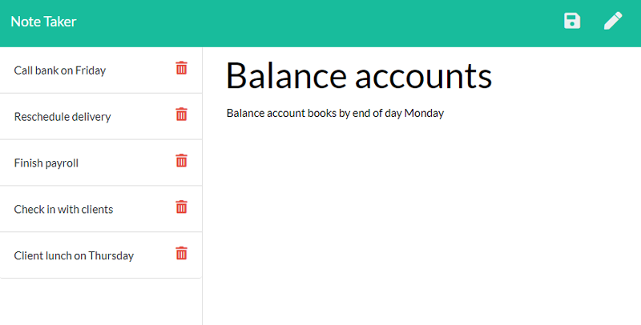

# NoteTaker

## Description

An application that can be used to write and save notes.

## Table of Contents 

* [Website](#Website)

* [Usage](#Usage)

* [License](#License)

* [Repository](#Repository)

* [Questions](#Questions)

## Website:

[https://dry-reef-38751.herokuapp.com/notes](https://dry-reef-38751.herokuapp.com/notes)

## Usage

The following images show the web application's appearance and functionality: 

## License:

This app is licensed under the MIT license.

## Repository:

[https://github.com/jrdrenth/NoteTaker](https://github.com/jrdrenth/NoteTaker)

## Questions:

If you have any questions, please contact me at john.drenth@gmail.com.  My github profile can be found at [https://github.com/jrdrenth/](https://github.com/jrdrenth/).

